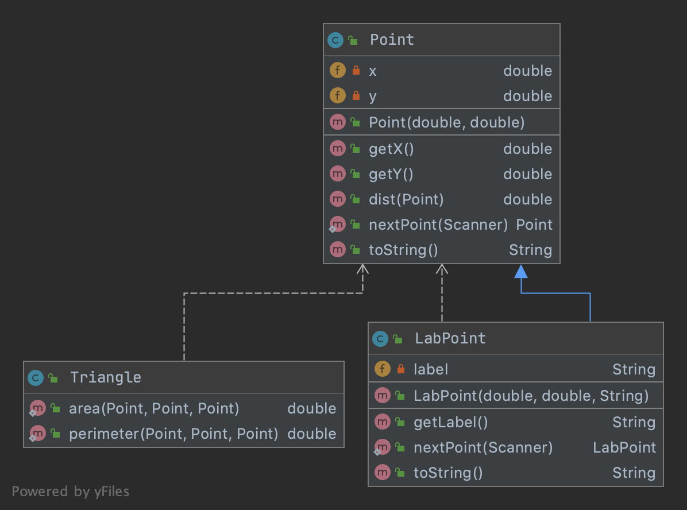
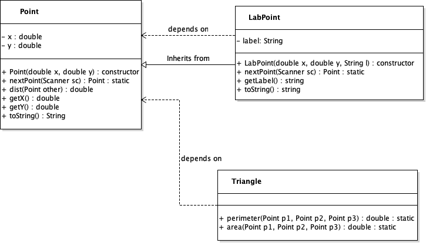

# Extending Objects via Inheritance and Subtyping

## Public Interface of a Class

In the last class, we reviewed how Java works and spent some time defining a `Point` class and a `Line` class, built using `Point`s. A key idea we covered was **encapsulation** that the data and methods of the class should exist within the same class for ease of understanding and organization. 

Another way to view this construction is via *information hiding* and creating a **public interface**. That is, we encapsulated data and methods such that the programmer only need to know the public interface to the class in order to use it, the rest is hidden via private fields and methods. 

This is an extremely important idea because often in Java, you're only provided with the compiled `.class` file for a program, and not the source code. You may not, nor should you, know the gritty details of how a method functions, but rather just the interface. For example, you don't need to know how the `dist()` method calculates distance, just that it will return the distance between one object and another. 


## Extending a Class

You might be worried now, what if I want to modify or repurpose classes that were provided to me? If I don't have the source code, how do I do that? Let's work through a small example.

### Points and Triangles

Object oriented programming, fortunately, provides a straight forward mechanism for doing that through **inheritance** and **sub-typing**. To see how this works, let's continue with our example of `Point` classes, but this time, let's assume that these are all ready written and final. 

```java
public class Point {
   private double x, y; //the x,y fields
   public Point(double x, double y); //construct a point from an x,y
   public Point(Point other); //construct a point from another point
   public double getX(); //return the x component
   public double getY(); //return the y component
   public double dist(Point other); //distance to another point
   public String toString(); //return the string representation
   public static Point nextPoint(Scanner sc); //given a scanner, read two doubles,
                                              //and return a new point
}
```

Let's also assume we have a `Triangle` class with some handy static methods for calculating the area of a triangle and perimeter of the triangle defined by using the `Point`. Again, we know the public interface, but not how it's implemented.

```java
public Triangle {
    //return perimeter of the triangle defined by points p1,p2,p3
    public static double perimeter(Point p1, Point p2, Point p3);
    //return the area of the triangle
    public static double area(Point p1, Point p2, Point p3); 
}
```

Now you can imagine how these might have been implemented, but it doesn't matter, as long as it works and the public interface makes sense. If you're really curious,  you can display/hide the source code by clicking below:

 
* <a href="javascript:void(0)" onclick="$('.point-java').toggle('slow')">Point.java </a> 
<div class="point-java" style="display:none">

```java
//Point.java
import java.util.Scanner;

public class Point {

    private double x, y;

    public Point(double x, double y) {
        this.x = x;
        this.y = y;
    }

    public Point(Point p) {
        this.x = p.getX();
        this.y = p.getY();
    }
    
    public double getX() {
        return this.x;
    }

    public double getY() {
        return this.y;
    }

    public double dist(Point other) {
        return Math.sqrt(Math.pow(this.x - other.getX(), 2) +
                         Math.pow(this.y - other.getY(), 2));
    }

    public static Point nextPoint(Scanner sc) {
        if(!sc.hasNextDouble()) { 
            return null;
        }
        double x = sc.nextDouble();
        if(!sc.hasNextDouble()) { 
            return null;
        }
        double y = sc.nextDouble();
        return new Point(x, y);
    }

    public String toString(){
        return "(" + x + "," + y + ")";
    }
}
``` 
</div>

* <a href="javascript:void(0)" onclick="$('.triangle-java').toggle('slow')">Triangle.java</a> 
<div class="triangle-java" style="display:none">
```java
public class Triangle {
        //Heron's formula
        public static double area(Point p1, Point p2, Point p3) {
            double semiperm = Triangle.perimeter(p1, p2, p3) / 2;
            return Math.sqrt(semiperm * (semiperm - p1.dist(p2)) *
                                        (semiperm - p1.dist(p3)) *
                                        (semiperm - p2.dist(p3)));

        }
        public static double perimeter(Point p1, Point p2, Point p3) {
            return p1.dist(p2) + p1.dist(p3) + p2.dist(p3);
        }

}
```
</div>

Using these public interfaces, we can write a reasonably complex and interesting program that given four `Point`s, finds the triangle with the largest area.

```java
import java.util.Scanner;

public class LargestArea {
    public static void main(String args[]) {
        Scanner sc = new Scanner(System.in);

        System.out.println("Enter four points:");
        //declare four points in an array
        Point points[] = new Point[4];
        for(int i = 0; i < points.length; i++){
            points[i] = Point.nextPoint(sc);
        }

        //create all four possible triangles by group three points together
        Point triangles[][] = { {points[0],points[1],points[2]},
                                {points[0],points[1],points[3]},
                                {points[0],points[2],points[3]},
                                {points[1],points[2],points[3]}};

        //find the triangle with largest area!
        int maxI = 0;//assume it's the first, first
        double maxArea = Triangle.area(triangles[maxI][0],
                                       triangles[maxI][1],
                                       triangles[maxI][2]);
        for(int i = 1; i < triangles.length; i++){
            double curArea = Triangle.area(triangles[i][0],
                                           triangles[i][1],
                                           triangles[i][2]);
            if( curArea > maxArea){
                maxI = i;
                maxArea = curArea;
            }
        }

        //print out the max triangle
        System.out.println("The largest triangle is:");
        System.out.printf("%s %s %s\n",triangles[maxI][0],
                                       triangles[maxI][1],
                                       triangles[maxI][2]);
        System.out.printf("With area %.2f\n",maxArea);

    }
}
```
Here an example of the output:
```
Enter four points:
1 1
2 3
4 5
2 2
The largest triangle is:
(2.0,3.0) (4.0,5.0) (2.0,2.0)
With area 1.00
```


### Inheritance: an "is-a" relationship rather than a "has-a"

Let's suppose we want to update our program so that instead of having it print the coordinates of each point, we can apply a label to each point that will print. For example:

```
Enter four points:
P 1 1
Q 2 3
R 4 5
S 2 2
The largest triangle is:
Q:(2.0,3.0) R:(4.0,5.0) S:(2.0,2.0)
With area 1.002
```

What we would really like to do to solve our problem is to go add a "label" field to the class `Point`, so that when we had chosen the three points that defined the triangle of largest area, we could simply write out their labels through a getter method. However, we can't modify the class `Point` --- we technically don't have the source code to `Point` --- and even if we could, we may want to have `Point` objects that don't have labels. 

We already have a mechanism for using existing classes to build new classes. You use it whenever you create a class that has, for example, a `String` field (data member). We haven't given it a special name, but if you want to know, we call this *composition* of classes. If class `Foo` has two `String` fields, for instance, we would say that `Foo` is composed of two `String`s. Composition is a *has-a* relationship. Foo "has-a" `String` field.

If we try to combine a point and a `String` label by composition, we get a new class, maybe `LabelPoint` class like below. 

```java
public class LabelPoint {
   Point p;
   String label;
   //...
}
```
And it's memory diagram would look like the following for an instance `lp` of `LabelPoint`:

```
  STACK           HEAP
                                                   
  .--------.      .-----------.        .-------.
  | lp | .-+----->|   p   | .-+------->| x | 4 | Point
  '----'---'      |-----------|        |-------|
                  | label | .-+--.     | y | 5 |
                  '-----------'  |     '-------'
                    LabelPoint     |     .-----.
                                 '---->| "R" | String
                                       '-----'
```

This is really ugly for us. Why? Well **this is no longer a point**, which means that we can't just pass three `LabelPoint`s to the `Triangle` constructor anymore so that we can calculate the area, but we constantly have to pull out the "point-part" of the `LabelPoint` to pass around. In fact, this class has no methods yet at all, and we'd have to recreate all the methods we already have for `Point` in the new `LabelPoint` class. Either that or, we'd need to also write a new `Triangle` constructor --- which we can't because we don't have the source code for that! So instead, we'd also need to write a *new* `LabTriangle` class with new methods to handle `LabelPoint`s ... it's a mess! And this is because a LabelPoint defined this way *has-a* Point, rather than *is-a* Point.


### Deriving a new class with `extends` — adding fields

Instead we can use **inheritance**, as in this new `LabelPoint` is a *child* of `Point`, or put another way, we define `LabelPoint` as *derived* from the class `Point`. In the Java parlance, `LabelPoint` extends `Point` — which means that a `LabelPoint` object **is-a** `Point`, but it is a `Point` with some extra features. Thus, all the code that worked for `Point`, all the methods of class `Point` and methods that take `Point`s as arguments, all still works. But we can add more! We are *extending* the class Point. 

The existing class `Point` is called the "super-class" (or parent class) and the new class `LabelPoint` is called the "sub-class" (or child class). Sometimes, we'll use "super-type" and "sub-type" as well, but it means the same thing.

To derive a new class `LabelPoint` from class `Point`, and add a `String` label, we would write

```java
public class LabelPoint extends Point { //extend the Point
   private String label;
}
```

and a  memory diagram for an an instance `lp` of `LabelPoint` would look like

```
  STACK           HEAP
                           Point
  .--------.      .----------.
  | lp | .-+----->|   x  | 4 | 
  '----'---'      |----------|
                  |   y  | 5 |
                  |..........| 
                  |..........|    .-----.
       extended   |label | .-+--->| "R" |  String
                  '----------'    '-----'
                  LabelPoint
```

Since `lp` is a `Point` **and** and a `LabelPoint` then we can call all the methods of `Point` on `lp`, including `dist()` with other `Points` or `LabelPoints`, as well as `toString()`. That is, `LabelPoint` inherits all the methods and data of `LabelPoint`. 

### Deriving a new class with `extends` — constructors

One problem with our new `LabelPoint` is that it also inherits the `Point` constructor, but the `Point` constructor is unaware of the new field `label` we added. 

The constructor for a `LabelPoint` would naturally have three values - `x`, `y`, and label `lab`. However, the constructor has to split duties and say that we want the `Point` part of the `LabelPoint` to be initialized with `x` and `y`, and the label part with lab. But, once we do that, we find there is another problem. 

Consider the following constructor (which does not compile):

```java

//THIS DOES NOT COMPILE !!

public class LabelPoint extends Point {
    private String label;
    public LabelPoint(double x, double x, String lab){
        this.x = x; //x and y inheritted from Point, but declared private
        this.y = y; //can't read/write them directly
        this.label = lab;
    }
        
}

```

When we try and use `this.x` we would find we get a compiler error because we're access a `private` field outside the class. While, yes, `LabelPoint` is a `Point`, **direct access** to `private` fields *are not* inherited! The fields are, however, inhereted (i.e. they can store values), but they're just inaccessible.

We could have declared the fields of `Point` as `protected` instead of `private`, which gives all the protections of `private` outside the class, but allows sub-classes access to the fields/methods (discussed more later). But, **we cannot edit** `Point`, so how do we solve this problem? We need to set the fields in the super-class, or put another way, we need to call the constructor of the super class.  

Java provides a `super` which allows us to refer to the super-class and, in this context, allows us to explicitly call the constructor for  `Point`, initializing the `Point` part of the new object. After, we can initialize the `LabelPoint` part. 

```java

public class LabelPoint extends Point {
    private String label;
    public LabelPoint(double x, double y, String lab) {
        super(x, y); //initilize the Point part, sets x and y
        this.label = lab; //initialize LabelPoint part
    }
}

```

At this point, we have a full `LabelPoint` constructor that has inherited all the fields and methods from `Point`, which is great! But, we still need to make some modifications in order to leverage the new field `label`.

### Deriving a new class with `extends` — adding methods

In our new `LabelPoint` class, we need to add a new getter method for the `label` as it's `private` and inaccessible otherwise. This is not a problem for `LabelPoint` class, but would not have made sense for `Point` as it has no label.

```java

public String getLabel() { 
    return this.label;
}
```

At this point, you may notice that `LabelPoint` is *more* expressive than `Point`. For starters, it has an additional data field `label` but now it also has an additional method `getLabel()`. And this is typically the case with sub-classes, they should trend to higher expressive and more specificity for the item being described. Otherwise, the super-class would have sufficed.


### Deriving a new class with `extends` — overriding methods


We are not quite done with `LabelPoint`'s definition yet because it has inherited two methods (that would still function) but are not expressive enough, yet. 

First the `readPoint()` static method which scans in a `Point` doesn't take into account that for a `LabelPoint` we need the label as well. So we can *override* that method with a new version, just like we wrote our new constructor. In this case, we can take advantage of the static method `Point.nextPoint()`, so we don't have to complete write it from scratch, but rather add just the needed functionality.

```java
public static LabelPoint nextPoint(Scanner sc) {
        if(! sc.hasNext()) 
            return null;
        String lab = sc.next(); //read label
        Point p = Point.nextPoint(sc); //read point
        if(p == null) 
            return null; //error check
        return new LabelPoint(p.getX(), p.getY(), lab); //return new LabelPoint
    }
```

We also need to do the same for `toString()`. The inherited version from `Point` would work fine, but doesn't account for the `label`. 

```java
    public String toString() {
        return this.label + ":(" + getX() + "," + getY() + ")";
    }
```

While the above `toString()` works fine, it is unsatisfying because we are re-implementing functionality for converting the `x` and `y` component of the `Point` to a string. Just like with the constructor, we can use the `super` keyword to access the super-classes version of `toString` to save us some time and maintain good code reuse.

```java
    public String toString() {
        return this.label + ":" + super.toString();
    }
```

There is even an `@Override` annotation (similar to the `@Test` annotation in Junit tests) that you can use in child classes to let the compiler know you intend to override the method from the parent class; if you modify its signature by mistake, the compiler will tell you!

### Putting it all together

Now that our `LabelPoint` class is ready to go, we can modify our `main` method from before in only a few spots, using `LabelPoint` instead of `Point` to get the functionality we desired.

```java
        //...
        LabelPoint points[] = new LabelPoint[4];
        for(int i = 0; i < points.length; i++){
            points[i] = LabelPoint.nextPoint(sc);
        }

        //create all four possible triangles by group three points together
        LabelPoint triangles[][] = { {points[0],points[1],points[2]},
                                   {points[0],points[1],points[3]},
                                   {points[0],points[2],points[3]},
                                   {points[1],points[2],points[3]}};
        //...
```
The rest of the code stays the same, and in that lies the power of inheritance and extending.  Click below to see the completed versions of the code.

* <a href="javascript:void(0)" onclick="$('.LabelPoint-java').toggle('slow')">LabelPoint.java</a> 
<div class="LabelPoint-java" style="display:none">
```java
import java.util.Scanner;

public class LabelPoint extends Point {
    private String label;

    public LabelPoint(double x, double y, String lab) {
        super(x, y);
        this.label = lab;
    }

    public LabelPoint(LabelPoint lp) {
        super(lp.getX(), lp.getY());
        this.label = lp.getLabel();
    }

    public String getLabel() {
        return this.label;
    }

    public static LabelPoint nextPoint(Scanner sc) {
        if(!sc.hasNext()) 
            return null;
        String lab = sc.next(); //read label
        Point p = Point.nextPoint(sc); //read point
        if(p == null) 
            return null;
        return new LabelPoint(p.getX(), p.getY(), lab); //return new LabelPoint
    }

    public String toString() {
        return this.label + ":" + super.toString();
    }
}
```
</div>

* <a href="javascript:void(0)" onclick="$('.largestarealab-java').toggle('slow')">LargestAreaLab.java</a> 
<div class="largestarealab-java" style="display:none">
```java
import java.util.Scanner;

public class LargestAreaLab {
    public static void main(String args[]) {
        Scanner sc = new Scanner(System.in);

        System.out.println("Enter four points:");
        //declare four points in an array
        LabelPoint points[] = new LabelPoint[4];
        for(int i = 0; i < points.length; i++) {
            points[i] = LabelPoint.nextPoint(sc);
        }

        //create all four possible triangles by group three points together
        LabelPoint triangles[][] = { {points[0],points[1],points[2]},
                                   {points[0],points[1],points[3]},
                                   {points[0],points[2],points[3]},
                                   {points[1],points[2],points[3]}};

        //find the triangle with largest area!
        int maxI = 0;//assume it's the first, first
        double maxArea = Triangle.area(triangles[maxI][0],
                                       triangles[maxI][1],
                                       triangles[maxI][2]);

        for(int i = 1; i < triangles.length; i++) {
            double curArea = Triangle.area(triangles[i][0],
                    triangles[i][1],
                    triangles[i][2]);
            if( curArea > maxArea) {
                maxI = i;
                maxArea = curArea;
            }
        }

        //print out the max triangle
        System.out.println("The largest triangle is:");
        System.out.printf("%s %s %s\n", triangles[maxI][0],
                triangles[maxI][1],
                triangles[maxI][2]);
        System.out.printf("With area %.2f\n", maxArea);

    }
}
```
</div>


# Private classes 

Now that we have a better understanding of inheritance, lets look at another example. Consider that we've been provided with a `Queue` class for strings with the following fields/methods. 

```java
public class Queue {
    private Node head; //head of the queue
    private Node tail; //tail of the queue
    
    //private Node class for the linked list 
    //implementation of a queue
    private class Node {
        public String data;
        public Node next;
        public Node prev;
        public Node(String d);
    }
    
    public boolean empty();//returns true if empty, false otherwise
    public void enqueue(String s);//enques the s on the queue
    public String dequeue();//returns head of queue, or null if empty

}

```

Again, we can imagine how this was implemented, and for now, we don't need to know. The public interface is sufficient for us as the programmer to use this class in a program and/or add extensions to it. If you really want to see how the queue is implemented, you can click below, but the beauty of inheritance in OOP is that you don't really, really need to know. 

* <a href="javascript:void(0)" onclick="$('.queue').toggle('slow')"> Queue.java</a> 

<div class="queue" style="display:none">
```java
public class Queue {
    private class Node {
        public Node next; //forward pointer
        public Node prev; //back pointer
        public String data; //data element
        public Node(String d) {
            data = d;
            next = null;
            prev = null;
        }

    }

    private Node head; //head pointer
    private Node tail; //tail pointer

    public Queue() {
        //initialize to null
        head = tail = null;
    }

    public void enqueue(String d) {
        //create a new node
        Node newHead = new Node(d);
        newHead.next = head;


        if(head == null) {
            //empty queue
            head = newHead;
            tail = newHead;
        }else {
            //>=1 item queue
            head.prev = newHead;
            head = newHead;
        }
    }

    public String dequeue() {
        String d;
        if(head == null) {
            //empty queue
            d = null; 
        }else if (head == tail) {
            //1 item queue
            d = head.data;
            head = tail = null;
        }else {
            //>1 item queue
            d = tail.data;
            tail = tail.prev;
        }
        return d;
    }

    public boolean empty() {
        return head == null;
    }

```
</div>

You'll note that `Queue` makes use of a private class `Node`. A private class, functions much like any other class in Java, except its scope is within the containing class. That means as the programmer of the class, you can use the private class as you would any other class, when operating within the class. But this class should not be accessible out of the containing class context.

Implementing a Linked List (or other lined structures) is a canonical example of using private classes. It's a situation where you need additional class structure to implement the containing class, but that additional structure is not relevant to the user of the class. The `Node` class used to implement the list is not relevant to the user of the `LinkedList` or `Queue` as long as they function properly and there is a reasonable interface. 

As a private class within a containing class, the containing class `Queue`, it is often not necessary to declare fields private, as they are already constrained. Moreover, you generally want the containing class full access for convenience.

## Extending Queue for `size()`

The `Queue` defined above is minimal. It's missing some key functionality, such as the current size of the queue, or how many items are currently enqueued. With `extends` this is relatively easy to add, following the same procedures we outlined above with `Point` and `LabelPoint`.

```java
public class CountingQueue extends Queue {
    private int count;
    
    public CountingQueue {
        super();
        count = 0;
    }    
    public void enqueue(String s) {
         count++;
         return  super.enqueue(s);
    }
    public String dequeue(String s) {
       if(count > 0) {
         count--; //don't let it get less than 0
       }
       return super.dequeue(s); //will return null when empty
    }

    public int getSize() { 
        return count; 
    }
}
```


## Extending Queue for `peek()`

Another common functionality of a queue is to be able to peek at the first element enqueued by returning it but not actually removing it from the queue. We could write this routine (incorrectly) in the same way we extended `Queue` for `CountingQueue` to produce `PeekaCountingQueue` (keeping `CountingQueue`'s functionality).

```java
public class PeekaCountingQueue extends CountingQueue {

    public String peek() {
        if(empty()) 
            return null;
        String s = dequeue();
        enqueue(s);
        return s;
    }
}
```

But, that is entirely unsatisfying because we are actually dequeing and enqueing (and so it's not peeking really because it puts the item at the end of the queue rather than leaving it at the start) when what we really want to do is to write the following version.

```java
public class PeekaCountingQueue extends CountingQueue {

    public String peek() {
        if(empty()) 
            return null;
        return head.data;
    }
}
```

But we cannot do that because `head` was declared private in `Queue` and thus cannot be accessed directly. 

This brings up a dilemma as a programmer of classes. On one hand you want to restrict access to internal fields from users of your class, but on the other you want to allow extensions of the class to be functional and efficient. 

From the perspective of the implementer of class `Queue`, you would say that it's impossible to anticipate everything someone would want to do with a `Queue` and to provide public methods that make all possible operations implementable. That's true. A compromise between strict separation of interface from implementation and a wild west all-fields-are-public approach is to use the **`protected`** access modifier. 

When a field is marked `protected`, it means that it is accessible inside the class and any derived classes, but not from anywhere else (except the package, which we haven't talked about yet). If we change `head` and `tail` in `Queue` to be protected, implementing `PeekaCountingQueue` becomes easy and efficient (as above). The new `Queue` class definition would simply change to

```java
public class Queue {
    protected Node head; //head of the queue
    protected Node tail; //tail of the queue

    //... rest same as before
}

```

This is a case where we **do want to change the original class** and as a programmer and the designing of the API for a class, you need to plan ahead to make these changes. 


# UML Diagrams

A great tool when you begin to plan out the relationships between classes is to visualize how class depend and extend each other. The **UML** (or **Unified Model Language**) is a standard way to describe classes, their members, and relationships. As a starter, consider the UML diagram for the `Point` `LabelPoint` and `Triangle` classes used in the prior example. (Note this was generated by IntelliJ via yworks)



## Classes
Each box represents a class. The name of the class as indicated by `(c)` is at the top followed by the fields `(f)`. The methods `(m)` come below that. If a field or method is private, then a (red) lock &#128274; is used, if it is protected a (silver) key is used &#128273;, and if it is public an unlock &#128275; is used. A static method/field uses the diamond &#9672;. 

Note that there are other styles of UML. See this [wikipedia](https://en.wikipedia.org/wiki/Class_diagram) article for more details. Here's the same diagram generated using the [Violet UML Editor](https://sourceforge.net/projects/violet/). 



You'll note the symbols
* &#43; indicates public
* &#45; indicates private
* &#35; indicates protected (not shown)

It is highly recommend to use Violet UML for developing your UML structure. 

## Relationship between classes

There are two types of lines in this image, but UML diagrams can represent many different relationships

<div style="text-align:center">

</div>

Most important for the diagrams you will draw are the following:
* <span style="font-size:20pt">B &#10141; A</span> : (solid line, solid arrow) : indicates that Class B inherits from Class A
* <span style="font-size:20pt">B &#10509; A</span> : (dashed line, open arrow) : indicates that Class B depends on Class A to meets its functionality. A change in Class A changes the functionality of Class B

In IntelliJ the color of the arrows also indicate if the classes define `extend` (<span style="color:blue">blue</span>) or `implement` relationships (<span style="color:green">green</span>). We'll discuss `implement` later. 


## Using UML diagrams to (plan) your program

The relationship between UML diagrams and class structures are so tight, that in many IDE's, you can actually lay out your entire class structure in UML, and the IDE will create all the classes for you. In [Project 2](/project/2) you will be required to develop a UML diagram of your objects *before* you program.

As an example, let's consider the following program requirements. Suppose that we want to design an object model for an HR system at a company:
* Everyone is a employee; they have a first name, last name, salary, an address, and a list of organizational units
* Some employees are managers and they manage a number of other employees (including managers) as their direct reports
* Every unit has a unit manager
* The CEO is a special manager that has direct reports and also unit managers that report to them

Take a moment to try and draw out this diagram. When you're finished, click below to reveal the diagram below (with an explanation).

* <a href="javascript:void(0)" onclick="$('.company-uml').toggle('slow')"> Company UML</a> 

<div class="company-uml" style="display:none">
<div style="text-align:center">

</div>

As a brief explanation of this UML diagram, we should start with the base `Employee` class. This stores all the core employee information, and from this we can derive the `Manager` class. The `Manager` also need to track their direct reports, in addition to being a normal employee. These employees can be stored in an `EmployeeList`, which we must define. In this example, that list is a linked list.

Also, as all employees are parts of a `Unit`, we add that class as well, whose fields is the `Manager` and the list of employees in that Unit. 

Finally, the `CEO` is a derived from the `Manager`, but also maintains a list of the `unitManagers`.

Finally, finally, the public/private/protected fields are not included as it would get quite large quite quickly with having to implement getters and setters. So you can assume all members are protected and have getters/setters.
</div>


---
Material on this page adopted  with permission from [USNA courses ic211](https://www.usna.edu/Users/cs/nchamber/courses/ic211/s19/index.html), taught by Nate Chambers, Gavin Taylor, Chris Brown, and many others. Thank you. 

