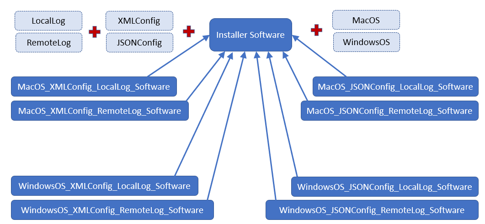
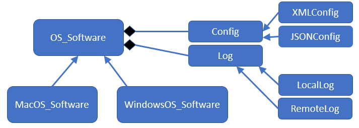

# Design Patterns

When designing software for a new system, developers should make an effort to reuse as much existing code as possible. For example, rather than writing your own linked list from scratch, check to see if there is an existing library (especially one supported by Oracle/Java) for this functionality, and use it instead, if possible. Existing libraries typically have a lot of implicit testing and debugging already done simply because so many people are already making use of that code.

Often, such as with these libraries, the precise functionality you need is readily available. Now that you know many of the OOP properties of inheritance, it's also often possible to extend classes in these libraries to suit your own needs, for example, by overriding methods or using generics to specify the type stored in a container class. However, sometimes the module on concept that you want to implement is not a specific library class or method, but more of a concept.

For example, imagine that you have multiple threads trying to access a single object, such as a log list that collects all the logging information from this pool of threads. We want to ensure that there is only one *log object* in existance at any point in time, rather than these threads (or whoever spanned them) accidentally creating multiple logging objects. Remember, our goal is to maintain a single logging object to collect all logs from all threads. One way we could do this is to ensure that the constructor for the *log object* is only called once. While, in theory, this is something simple to do, it is much harder to enforce. 

It turns out there is a desing pattern, called a *singleton*, which can solve our issue above. We'll cover it below. The idea is there is a template and/or blueprint (as opposed to a specific class or library we would download) that developers can use as a guideline how to implement this desired functionality. The **design pattern is a concept that provides a conceptual solution to a commonly-occuring software engineering problem**, although templates/blueprints are available for these common design patterns.

##  Importance of Design Patterns

Design patterns are a useful way to incorporate best pratices and lessons learned for common object-oriented challenges. Design patterns have been around since the 1990s; the same time when Java and OOP became quite popular in common software development. Now, these are dozens of design pattersn that have been identified and made available, as templates. Design patterns, like Java libraries, are tools that have been used, debugging, and improved upon over decades and millions of use cases. Therefore, they're excellent resources for writing better and more maintainable code.

## Examples of Design Patterns

The initial set of design patterns was made avaiable in a [book written by the *"Gang of Four"*](https://en.wikipedia.org/wiki/Design_Patterns). There are various patterns listed and explained there; more design patterns and resources can be found online.

Design patterns generally fall across three main categories:
* **Structural**: defines ways to combine classes and/or objects
* **Behavioral**: defines ways objects can communicate between one and another
* **Creational**: defines ways for objects to be created, that is, how and what types of objects needs to be created in what cases

Below are some examples from the categories above that we'll cover in this class.

### Singleton (creational design pattern)

Above, we illustrated a situation where it would make sense to ensure that an object only gets created once. In some sense, this is like creating a global, single resource for this item. We saw how that would make sense if conceptually it is important to have only one instace of something like a logger. It might also make sense (especially from a multithreading perspective) to have only a single object to access a database instance or a file system, as this may allow for better service and synchronization. There may also be other reasons to have a single object, for example, if it takes up a lot of memory, or a long time to create.

A singleton object gives you "global" access to that single object, rather than making multiple instances of that object. That is, rather than allowing developers to call the constructor to this object type multiple times (which would defeat the purpose because it would), the pattern enforces that a constructor for this "global" object is only actually called once, by essentially overriding the functionality of the constructor itself:

```java
public class Singleton {
    // This is a private member variable so that the singletonInstance
    // can only be accessed through the getInstance() method.
    private static Singleton singletonInstance;

    // Private constructor forces the class to be instantiated 
    // via the getInstance method.
    private Singleton() {
        // private constructor
        // set up the object here
    }

    // Method to get an instance of this class.
    public static Singleton getInstance() {
        // If this singleton instance is null, 
        // then construct a new instance.
        // Otherwise return the existing instance.
        if (singletonInstance == null) {
            singletonInstance = new Singleton();
        }

        return singletonInstance;
    }
}
```

First, even though we're looking at Java code, this class is not something developers would use or extend directly with `extends`; instead, they would define their own class (for example `LoggerSingleton`) and adapt it to that use case. 

Note that the constructor is `private`; this restricts access such that no one else can call the constructor directly. The `private` constructor would be where you would set up the logger, connect to a database, or otherwise instantiate the actual object that you only want a single copy of.

Instead, people who want to get access to this singleton object must do so by calling the `getInstance()` method; this would conceptually replace the constructor call they would normally want to include in their code (recall, the constructor is `private`). The `getInstance()` method is `public` and `static`, so it can be called on the class itself, rather than any object of the class. You can see that it will check, if the `private` constructor has never been called (therefore the `singletonInstance` is `null`), it calls the constructor once and only once to instantiate the object. If the object already exists, the constructor is not called. In both cases, the reference to the object is then returned.

Note that we saw this example earlier in a worksheet, and, as written, it is not thread-safe because of this line: `singletonInstance = new Singleton();`. To make it thread-safe, you'd want to `synchronize` the method.

Here is what the Singleton design pattern could look like for reading in a very large file from a database one time:

```java
public class LargeFile {
    // This is a private member variable so that the file
    // can only be accessed through the getInstance() method.
    private static LargeFile singleton;
    private static StringBuffer fileContents;

    // Private constructor forces the class to be instantiated 
    // via the getInstance method.
    private LargeFile() {
        // private constructor
        // set up the object here
        fileContents = new StringBuffer();

        try{
            FileInputStream fstream = new FileInputStream("my_large_file.txt");
            BufferedReader br = new BufferedReader(new InputStreamReader(fstream));

            String strLine;
            while ((strLine = br.readLine()) != null)   {
                fileContents.append(strLine);
            }
            fstream.close();     
        } catch (IOException e){
            System.out.println("Sorry could not open your file.");
        }

    }

    // Method to get an instance of this class.
    public static LargeFile getInstance() {
        // If this singleton instance is null, 
        // then construct a new instance.
        // Otherwise return the existing instance.
        if (singleton == null) {
            singleton = new LargeFile();
        }

        return singleton;
    }
}
```

### Factory (creational design pattern)

Another type of situation where we might want to control the creation of objects (like we did above) is when you have a conceptual hierarchy of objects that all have the same parent class, who's creation needs to be managed. For exmaple, imagine that we have software that is responsible for generating accounts for new users of GWeb. These accounts are used by students, faculty, and staff at the school, but they each store different fields and have different functionality. Perhaps there is a GUI that an administrator uses to select which type of account needs to created. 

In this case, if we set up an OOP hierarchy with `GWebAccount` as the abstract parent class, and children as `StudentAccount`, `FacultyAccount`, and `StaffAccount`, we can use these accounts interchangeably for any method expecting to deal with a `GWebAccount`. However, we would need to call each child class' constructor specifically, depending on what type of account is being created. One could imagine the following type of code:

```java
// note : this is NOT the Factory pattern below

String accountType = getAccountTypeFromGUI();
GWebAccount account = null;

switch(accountType){
    case "student":
        account = new StudentAccount(getFirstNameFromGUI(), getLastNameFromGUI(), ...);
        break;
    case "faculty":
        account = new FacultyAccount(getFirstNameFromGUI(), getLastNameFromGUI(), ...);
        break;
    case "staff":
        account = new StaffAccount(getFirstNameFromGUI(), getLastNameFromGUI(), ...);
        break;        
}
```

This code is fine, but not really maintainable, because each time a new type of account is created, the switch statement needs to be updated. This is unfortunate, because the rest of this file (and code) shouldn't care about what type of account was actually created, since the `account` variable is of the parent class' type. 

Instead, it would be nice if we could move this conditional logic into another location, where we can separate concerns and just rely on an object of the right type being delivered (again, where that type is specified). It turns out the **Factory design pattern allows us to create objects of different types, based on input** as long as those objects all maintain a specific class hierarchy. Here is the general template for a Factory:

```java
public class ItemFactory {

  public static Item getItem(String itemType, ...list of inputs that could be sent to parent class constuctor...){
      switch(itemType){
          case "student":
              return new StudentAccount(...);
          case "faculty":
              return new FacultyAccount(...);
          case "staff":
              return new StaffAccount();   
      }
    return null;
  }
}
```

And then we could call this `static` `getItem()` method on the `ItemFactory class`. Here is what this example would look like for the GWeb accounts:

```java
public class AccountFactory {

  public static GWebAccount getAccount(String type, String firstName, String lastName, ...){
      switch(type){
          case "student":
              return new StudentAccount(firstName, lastName, ...);
          case "faculty":
              return new FacultyAccount(firstName, lastName, ...);
          case "staff":
              return new StaffAccount(firstName, lastName, ...);
      }
    return null;
  }
}
```

which would then be called in the original code as:

```java
GWebAccount account = AccountFactory.getAccount(getAccountTypeFromGUI(), getFirstNameFromGUI(), getLastNameFromGUI(), ...);
```

That's much cleaner! While yes, we did basically just move the switch statement into our Factory pattern, this allows us to separate concerns because this GUI processing code (now one line) doesn't actually care what kind of account is being created later on in the same method.

### Adapter (structural design pattern)

The previous two design patterns allow developers to design elegant and robust solutions for situations that involve rules and requirements around creating objects. In other instances, we want to define how we can combine objects elegantly. Of course, Java already allows this, as a class will typically have its own fields.

One example of a desirable structure would be to have a classes that have separately implemented *unrelated interfaces* that can use this design pattern so they can work together successfully. The **Adapter design pattern can be used as an object that joins these unrelated interfaces across two classes**.

For example, imagine that we have a very nice implementation for mining data from scientific articles for information about penicillin. These articles were once converted into HTML (so they can be easily viewed on a webpage), and your code currently expects the articles to come in, in that format. The software will check to see if the word *penicillin* appears in the HTML title of the article and mines any experimental results from tabular data in the HTML file. So far, it works very nicely, as long as the articles being processed are in HTML format. The data might look like this:

```HTML
<HTML>
  <HEAD>
    <TITLE>Penicillin saves millions of lives</TITLE>
  </HEAD>
  <BODY>
    ...
    <TABLE>
      <TR><TD>Penicillin experimental results</TD></TR>
      ...
    </TABLE>
    ...
  </BODY>
</HTML>
```

However, imagine we obtained a bunch of different articles from a different server/journal that stored data in JSON format. Unfortunately for us, our current code won't work because of the type mismatch. Take a look at how the same data might look in a JSON file:
```JSON
{
 "title":"Penicillin saves millions of lives",
  ... ,
  "experimental_results": {...},
  ...
}
```

What is there was a way to provide a wrapper around these JSON files that would allow them to be treated as HTML files, assuming we specify how to make that conversion? It turns out, this is what the Adapter design pattern is for. Specifically, we can conceptualize a way a JSON file could be converted to an HTML file, at least as far as the relevant pieces are concerned.

We can imagine what the Java code looks like to open and process each of these files is below. These methods allow the user to pull out the important pieces of these files, and later, check if what they returned contains the relevant keyword or not (not show below).

```java
public class HTMLParser {
  public static String getTitle() { ... }
  public static String[] getTableCells() { ... }
}
```

```java
import JSON; // this is a lie
public class JSONParser {
  public static String getTitle() { ... }
  public static ArrayList<String> getExperiments() { ... }
}
```

we can then define an Adapter class for the JSON processor to make it compatible with the HTML processor:
```java
public class JSONParserAdapter extends HTMLParser {
  private JSONParser json;
  public JSONParserAdapter(JSONParser jsonIn){
    json = jsonIn;
  }

  public static String getTitle() {
    return json.getTitle();
  }
  public static String[] getTableCells() {
    return json.getExperiments().toArray();
  }
}
```

Now, any code that was expecting to use an `HTMLParser` can also use the `JSONParserAdapter` in the same place, since the latter extends the former. Note that in the `JSONParserAdapter` we pass in the `JSONParser` object to the constructor; it is this object and its functionality that we're essentially providing a wrapper around with the Adapter.

### Bridge (structural design pattern)

In the example above, we saw how a program might want to be able to process files from two different servers; in one server, we had academic articles in HTML format (so this was likely a web server), while in the other set of journals, the server provided articles in json format. There are also broader situations, where you have a system that needs to interact with a number of different platforms. In addition, these platforms could be conceptually split into multiple independent functional hierarchies. This is easiest to show with an example.

Let's imagine you want to write a tool that is responsible for installing software on your computer (like the .exe or .dmg files you run when downloading new programs to your computer). This tool needs to work on Mac and Windows (which have different terminal commands, i.e., 'ls' versus 'dir'). It also accept configuration files in both XML and JSON formats (as in the Adapter example above) so that it knows what kinds of permissions it is allowed to have and give to the software. Finally, it has a feature that allows the installer to connect to a networked database and send error logs back to some remote server, an as option.

We could summarize these features as some kind of class or interface:
* `MacOS` versus `WindowsOS` that both conceptually extend an `OS` interface or class
* `XMLConfig` versus `JSONConfig` that both conceptually extend or implement a `Config` interface or class
* `LocalLog` versus `RemoteLog` that both conceptually extend or implement a `Log` interface or class
* `InstallerSoftware` is the basic abstract class that all children will extend

We are seeing some nice OOP separation of concerns above, but the issue we run into is that we now theoretically need to provide a bunch of classes that have some or all of the possible combinations above, when we are writing our software:
* `MacOS_XMLConfig_LocalLog_Software`
* `MacOS_XMLConfig_RemoteLog_Software`
* `MacOS_JSONConfig_LocalLog_Software`
* `MacOS_JSONConfig_RemoteLog_Software`
* `WindowsOS_XMLConfig_LocalLog_Software`
* `WindowsOS_XMLConfig_RemoteLog_Software`
* `WindowsOS_JSONConfig_LocalLog_Software`
* `WindowsOS_JSONConfig_RemoteLog_Software`

While this is bad enough, it gets worse if we decide we also want to support Unix; that's another four classes to manage. Or, if we want to add another dimension, like whether the software is run as a command line or a GUI, then we would now have 24 classes total. This is bad. We could come up with more here; as you can see, there starts to be a state space explosion of all the possible combinations of these interfaces/classes. While we learned to love interfaces in this course for this very reason -- that a class can implement multiple interfaces -- the issue we could eventually run into is that adding an additional interface to this hierarchy forces us to double the number of classes we already have.

How do we keep all this necessary functionality, but avoid writing 24 (or more) separate classes for our software? Right now, our class/interface hierarchy looks as follows:



Not all of the extends/implements lines are shown to the light blue classes/interfaces because it would be illegible. But you get the idea; this is too much to manage, there are too many child classes at the bottom. How can we do better?

Instead of having a single parent class that is extended into tons of child classes as above, we can have a single class (in our case, the operating system version) which then uses aggregation to *contain* a field to the type of configuration (XML or JSON) and another field for the type of logging (local or remote). Our UML class diagram would now look like:



With this refactoring, the only two concrete classes you would have to write are the `MacOS_Software` and the `WindowsOS_Software`; the logging and configuration concepts become two interfaces, which are stored as fields in the `OS_Software` abstract class. We no longer have twelve concrete classes to manage; instead there are only two, plus four interfaces.

##  More on Design Patterns

The four examples above gave you a sense of when, how, and why Design Patterns can be useful in your own code. You'll be using them in your subsequent courses here at GW, so make sure you understand what they are; not a library or code you would copy, but a *template* for good software engineering in your own projects.