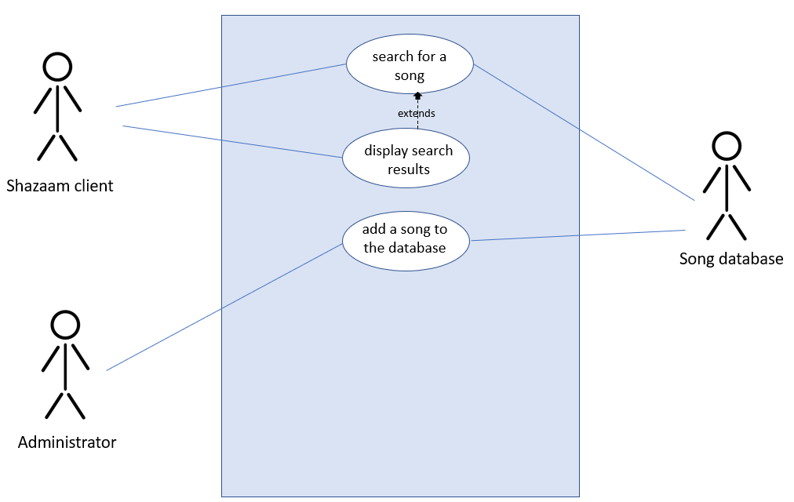

# Software Engineering

While our curriculum so far has focused a lot on learning how to code (in Java), it turns out that there is a lot more to writing software than just coding. In fact, developers often only spend ten percent of the time budgeted for a project on coding itself! Close to half the time might be spent on testing and debugging, while the remaining time is typically devoted to gathering requirements and designing the system. We're going to focus on these two activities in this lecture. In general, the following activities typically happen, in this order, when developing software:

* Requirements gathering
* Requirements analysis and specification
* System design and planning
* Implementation (coding and unit testing)
* Integration and system testing
* Deployment and maintenance

While it is difficult to skip any of these steps for any large-scale system, we'll see examples where the overall process is  more iterative in nature, rather than the sequential set of steps implied above.

## Gathering and specifying requirements

In your classes so far, it was probably rare for you to have to *design* your programs. In most cases, your professors detailed the requirements, either in English, or through unit tests (or some combination of both). In this course, each time you had to draw a UML diagram before writing your code, you were designing your solution. However, you likely haven't had a chance to gather requirements and figure out *what* needs to be built, as opposed to *how* you're going to build it (design).

Requirements gathering is arguably the most important and most difficult part of software engineering. Any requirement that is incorrectly captured -- or isn't captured at all -- can cause signficiant headaches, rework, and financial loss later in the development lifecycle. Perhaps the worst outcome is that a piece of software is delivered that isn't what the customer or the user even wanted! Fortunately, we have several decades worth of collective software engineering experience to help guide us on how to gather requirements more effectively. 

### What are software requirements?

First, let's define what a requirement is: any functionality your system needs to implement. We can have both **functional requirements** such as `the system must add two numbers together and show the result` as well as **non-functional requirements** such as `the system must query the database and return a result in less than 500ms`. Let's take a look at some example requirements from a very simple calculator:

* The user should be able to enter integers between -1,000,000,000 and 1,000,000,000
* The system should allow the user to add, subtract, multiply, or divide two numbers
* The system should allow the user to clear the previous results
* The system should have a display for the two numbers entered, the operation, and the result

Very quickly, we start to run into issues for even this simple calculator;
* What should happen when the system divides by zero?
* What should happen for overflow or underflow errors (such as multiplying together the two largest permissible inputs)?

We could convert some of those concerns above into additional requirements:
* The system should print an error message and clear the inputs when it is unable to perform the specified operation

One important feature of all requirements is that they should be written so that the system either meets the requirement, or it doesn't. For example, the four operations our calculator performs could be broken up into four separate requirements. Writing requirements this way makes it very easy to verify they've been completed during testing phases of our development lifecycle. 

So far, these were all examples of **functional requirements**. 

#### Non-functional requirements

In addition to functional requirements, it is often desirable (or legally required) to specify some constraints about how the system should operate. We often call these **non-functional** requirements, because they tend to capture more broad themes than a specific piece of functionality such as `should allow the user to add two numbers together`. These types of requirements address security, speed, operability, availability, safety, integrity, usability, and other *-ity* concerns not listed here.

An example of a non-functional requirement for our calculator above might be: `Buttons to enter digits should have at least 16 point font` as an example of a usability requirement (that is, making sure the font is large enough for individuals who may need larger lettering). Another important set of non-functional requirements often relate to the usability of the system. For example, will the font be large enough for everyone to read? Does the website layout and widgets match common conventions, so it is easy to use? There may even be legal requirements for usability, such as [508 compliance](https://en.wikipedia.org/wiki/Section_508_Amendment_to_the_Rehabilitation_Act_of_1973), that developers will have to manage.

The line between functional and non-functional requirements can be blurry -- this is okay. Just remember that **all requirements need to be testable**.

 
<b>PAUSE: Let's work on Q1-Q3 in the worksheet together now </b> 

### Use Cases for requirements gathering

While it is relatively easy to understand what a requirement is, it is much more difficult to *generate* them. **Requirements must be clear, complete, and consistent**. They also need to be **verifiable**, that is, they should be able to be used as test cases: you either met the requirement, or you didn't. But knowing what exactly needs to be designed and delivered to customers or users (and these are often *not* the same people, compounding the challenges of effective requirements specification) is extremely difficult. And, when things go wrong with missing, incomplete, or incorrect requirements, these errors are very expensive to fix during the coding testing part of the software design lifecycle (or worse, after deployment).

Therefore, we'd like a user-friendly way to capture and perhaps flesh out requirements that make this process of getting everything right more feasible and tractable. One way to do this is to use **use cases, which capture user-visible functionality** for the system to be designed. Focusing on these user-visible components is a good place to start generating requirements for a new system. Each **use case is meant to capture a discrete goal for the user**.

#### Generating a use case diagram

You can view a very simple example of a use case diagram below:

In this example, three actors (stick figured) are interacting with the Shazaam software we're writing (blue box). There are three use cases shown, indicating one feature of the system we will need to design. Note that an actor does not always have to be a human or a single entity; the song database is an actor in our example.

Each use case is a bubble in such a diagram, and would also contain notes about the following (in a table):
* **Overview**: describes what the scenario is
* **Notes**: any relevant details for the scenario (optional for simple use cases)
* **Actors**: an explanation of each of the actors
* **Preconditons**: anything that has to be true before the use case starts
* **Scenario**: a table that contains a series of steps to complete the use case. Each step has an *action (or stimulus)* and a *software reaction*

 
<b>PAUSE: Let's work on Q4 in the worksheet together now </b> 

## Software Development Lifecycle models

Recall the steps of the software development lifecycle from earlier:
* Requirements gathering
* Requirements analysis and specification
* System design and planning
* Implementation (coding and unit testing)
* Integration and system testing
* Deployment and maintenance

We've now seen some ways to gather and specify requirements; the next step would then be to design and plan out the system using UML diagrams (for example) and various managerial planning tools (for example, to know what milestones need to be it every week/month). 

### Waterfall versus agile models for developing software

However, it turns out that such a sequential set of steps, that is requirements->design->coding->testing->deployment isn't always the most efficient way to write code. Such an approach, called the **waterfall model** works best when it is possible to gather good and stable requirements upfront. In such cases, one could plan out the next several months of work, assuming each of the phases above can be completed without needing to change.

Unfortunately, it is often the case that we can't gather good requirements up front. Our clients and customers may not know exactly what they want; it is hard to envision a system that doesn't exist. The ecosystem of the software being developed may be rapidly changing, such as a mobile app meant to compete with other apps. Or, the system is so large that it might not be feasible to be able to effectively plan out all the details of every module and requirement up front.

In such cases, **agile methods** are more useful, compared to the waterfall approach. In an agile development process, only small pieces of the system are fully fleshed out at a time, and these often involve **prototypes** to gain client feedback on exactly what needs to be built. In other words, you could imagine a single use case being fleshed out over the course of a week, from requirements through testing. The following week, perhaps a different use case is completed. 

Such an approach has the benefit of reducing the number of changes that need to be incorporated later in the development lifecycle due to missing or incorrect initial requirements. The downside with agile approaches is that because they are incremental in terms of what is being completed, the overall system that gets delivered may be less efficient than had it been holistically planned out in the first place. 

 
<b>PAUSE: Let's work on Q5 in the worksheet together now </b> 

### Project planning

Whether you're using a waterfall or agile approach for developing your software, you'll need need to do some kind of planning in terms of:
* in what order components should be developed 
* who is going to be responsible for building which components
* who developers and team members should turn to for leadership on the project

The **critical path** of a project defines an ordered set of components/requirements that, if any item on this path is delayed, will delay the entire project. Items on the critical path cannot be serialized, and there is therefore no slack in terms of their deliverable dates in order for a project to stay on time. Other items that could be developed in parallel (assuming you have enough resources) would likely have some slack with respect to the critical path; delay in their delivery might not cause the entire project to end up late.

A project manager is often used to plan out the timeline, milestones, and deliverables for a software project. This is a different role than the **project lead** who is responsible for motivating the team, creating a vision, and other emotional support and soft skills. For smaller projects they may be the same person.

 
<b>PAUSE: Let's work on Q6 in the worksheet together now </b> 