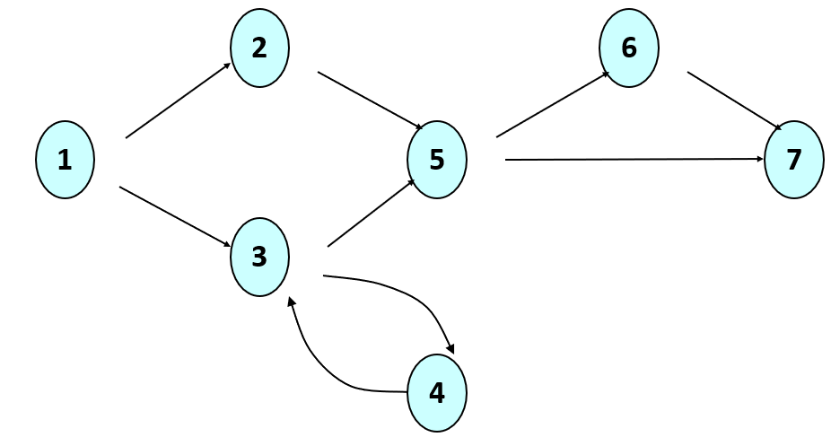

# Software Testing and Debugging

Software Developers will spend far more time testing and debugging their code than writing it! In your classes so far, you probably have been given test cases your code was expected to pass, and then wrote and debugged your code to meet these implicit requirements. In this lecture, we will focus on how to *design* test cases ourselves.

## Fault Localization

First, however, let's review what it means to debug your code. A fancy way of saying this is you're performing fault localization; you observe a program output that doesn't match the expected output for some input, and now you need to fix one (or more) lines of code to get your program to work. Fault localization typically involves tracing back from the line of code producing the incorrect output to where the problem actually was. Some items to keep in mind for this class, and your careers going forward:

* Except for trivially small programs (which these are not), it is virtually impossible for you (or the TA/professor) to look at the code and simply analyze what's going wrong. 
* Instead, you will need to use debug print statements (or a [debugger](https://www.eclipse.org/community/eclipse_newsletter/2017/june/article1.php)) to print out values from memory and/or see what path your inputs took through your code to arrive at the problem.
* There is nothing magical about using print statements to debug; this is typically what your professors are also doing for you. 
* Try to come to office hours and/or Ed from now on having done this legwork yourself, such that you can isolate a failing test cases (or input) *and* a line number in your code where you think something is going wrong, via print statements you've used to trace through it. You'll likely find that you'll be able to solve the vast majority of your logic errors on your own this way.

We've had a good amount of practice finding the faults in our code (using print statements, debuggers, and/or tracing). Now let's explore designing our own test cases.

## When to write tests

So far, you've typically only really worried about tests after you've written code. However, it is generally advisable to write test cases *before* you write your code. These can be designed, in part, during the gathering of requirements, or, at a lower level, after you have your UML diagrams.

There are also different flavors of testing, namely **verification** versus **validation**. The former checks that your implementation meets the requirements that were written, while the latter measures if the requirements themselves where what should have been written. For example, imagine someone writes requirements that explain how a self-driving car should navigate the roads around Foggy Bottom. Verification might mean making sure that the car stops at all stop signs. Validation might mean, making sure that the car, which has already been tested to drive on the left hand side of the road, is actually supposed to drive on the left hand side (like in the UK). In other words, you could have software that meets all its stated requirements, but is still wrong, because the requirements aren't valid.

It is possible to write your tests before you write code; this is called **Test Driven Development (TDD)**. Writing tests before writing code has several benefits:
* Your tests are not biased by your code
* Writing tests helps you think about how you might write code
* Writing tests helps you think about the requirements of your system
In some sense, we've been doing TDD this semester, since you were writing code to pass against existing test cases.

At the lowest level (closest to your code), developers typically write **unit tests** (preferably before they write code). You've seen unit tests throughout the semester; these are often written one unit test file per class. We usually write unit tests for each method in a class. Then, you may write tests for checking how classes or modules work together (**module** or **integration testing**), and eventually you may do very high level **system testing**.

## Test Coverage Criteria

The goal of software testing is to increase confidence that your code works. There is no way to "prove" that your code is perfect, or correct, outside of some formal methods you might learn in your upper level courses. This is because it is virtually impossible to test your software on every possible combination of inputs. Instead, developers try to approximate various common, representative, and/or interesting inputs or paths through their code, and these those. Below are some example test coverage criteria commonly used in software testing.

### Input Domain Partitioning

Using Input Domain Partitioning, developers partition the possible input space into some number of classes, and then *draw samples from those classes in all possible combinations with respect to classes*. This is most easily explained with an example. Imagine you have the following simple method that is meant to return child, adult, or senior depending on the age of a person:

```java
public String getAgeGroup(int age){
	if (age >= 18 and age < 65)
		return "adult";
	if (age < 18)
		return "child";
	else 
		return "senior";
}

```

In terms of the possible input space (which is an almost infinite range of intergers, if we only consider compiling code) the following categories of human age might be reasonable to test:
* children, between 1 and 17 years old
* adults who are between 18 and 64 years old
* seniors who are 65 or older

But this is not yet a partition of all integers; we also need to consider:
* the age 0; is this a baby who was recently, born, or an invalid input?
* negative numbers, which are invalid inputs
* do we want, for error checking purposes, to raise an exception for any age over 120? And what does that mean for how our code will be useful over time?

Let's say we decide to allow 0-year-olds to count as babies, and should return `age too large` for anyone older than 120. Then, all six of the previous bullets become our partition of the input space; every possible integer is mapped to a specific value:
* invalid inputs: age less than 0 or greater than 120
* children: ages 0 through 17 inclusive
* adults: ages 18 through 64 inclusive
* seniors: ages 65 through 120 inclusive

In terms of integers, some of these partitions are effectively infinite in size, some have a few dozen possibilities, and some are rather small. It's not feasible to test every single possible input here, primarily because we'd have to specify the expected outputs. Instead, we will follow the following algorithm for selecting *useful and interesting* test cases from these partitions:
* choose one element from the **middle of each partition**
* choose **edge cases** for each partition, where it may "touch" another partition(s)

For example, while it's not foolproof (especially since we may be writing tests without seeing the code), it's likely safe to select some *middle* inputs as follows:
* invalid inputs: -2, 122
* children: 9
* adults: 45
* seniors: 80
We could certainly pick more arbitrary examples, but based on how we expect our code to shape up, it's not likely to bring us much more value.

Instead, we should pick *edge cases* for each partition that touch the other partitions:
* invalid inputs: -1, 121
* children: 0, 17
* adults: 18, 64
* seniors: 65, 120
These are arguably the most important test cases in this example, as they may catch common "off by one" errors when using the `if` statements above.

Finally, we should take a look at the smallest and largest possible integer values in Java for integers, and test our code on them, just to see if our algorithm might crash due to an overflow or underflow. In this example of ages, it doesn't make all that much sense, but for other examples that do more meaningful mathematical calculations, we would want to try to trigger these types of exceptions. Here are the additional inputs
* largest and smallest valid Java integers: `Integer.MIN_VALUE`, `Integer.MAX_VALUE`

Now that we have all of our test inputs, we manually specify the expected outputs:
```java
(-2, invalid)
(122, invalid)
(9, child)
(45, adult)
(80, senior)
(-1, invalid)
(121, invalid)
(0, child)
(17, child)
(18, adult)
(64, adult)
(65, senior)
(120, senior)
(Integer.MIN_VALUE, invalid)
(Integer.MAX_VALUE, invalid)
```

All that is left would be to code up these tests with a testing framework. In Junit, such assertions might look like:
```java
assertEquals("adult", getAgeGroup(18));
```

And we could see, at this point, that our code would fail these tests because we -- through writing test cases -- decided what to do with invalid inputs. This is why it might have been more useful to write these test cases first.

#### Order matters

In the examples above, there was only a single input to a method under test. However, we often have multiple inputs, or even a list as an input (which we consider multiple inputs since lists are sequences). Consider the problem where we want to find the minimum of a list of integers:

```java
public int findMin(int[] list);
```

Here, the input partitioning of lists needs to be considered from two views: where the minimum element is in the list, and the size of the list. We can come up with the following input partitions:
* lists of size 1
* lists of size 2
* lists larger than size 2

We can now consider the location of the minimum value in terms of these sizes:
* lists of size 1: only one location
* lists of size 2: min at start, or min at end
* lists of size 3 or more: min at start, min at end, min in middle

And we should also consider the range of possible values for integers:
* INTEGER.MIN and INTEGER.MAX
* negative, zero, and positive integers

Given all these different partitions, we can now combine them into the following tests across those partitions and their edge cases:
```java
 ([1], 1) // lists of size 1
 ([1,2], 1) // lists of size 2, min at start
 ([2,1], 1) // lists if size 2, min at end
 ([1,1], 1) // <--- added another one note above, realizing there could be more than one minimum
 ([1,2,3,4], 1) // lists of size 3+, min at start
 ([4,2,3,1], 1) // lists of size 3+, min at end
 ([3,2,1,4], 1) // lists of size 3+, min in middle
 ([1,2,3], 1) // smallest edge case of lists of size 3+, min at start
 ([2,3,1], 1) // smallest edge case of lists of size 3+, min at end
 ([2,1,4], 1) // smallest lists of size 3+, min in middle
 ([1,3,4,.....], 1) // whatever the longest list is of size 3+, min at start
 ([5,3,4,....7], 1) // whatever the longest list is of size 3+, min at end
 ([2,3,4,..1..], 1) // whatever the longest list is of size 3+, min in middle
 //Copy all tests above, and set 1 to be INTEGER.MIN
 ([INTEGER.MAX], INTEGER.MAX)
 //Copy all tests above, and set 1 to be -1
 //Copy all tests above, and set 1 to be 0
```

#### Partitioning the output

In the example above, we saw how we could literally partition the input space of all integers to generate test cases *systematically*. However, sometimes it is easier to think about generating inputs by partitioning the output. For example, consider a problem where you are trying to test the following method:

```java
public String triangleType(int side1, int side2, int side3);
```

We can think of the world of triangles partitioned as follows:
* equilateral triangles (all sides are the same)
* isosceles triangles (two sides are the same, the third side is different)
* invalid triangles (one side is longer than the sum of two other sides)
* every other triangle that doesn't fall into one of the three categories above is a valid other triangle

Applying the techniques above, we can generate the following inputs and expected outputs:
```java
 ([3, 3, 3], equilaterial)
 ([5, 5, 3], isosceles)
 ([3, 4, 9], invalid)
 ([4, 5, 6], other)
 ```

We also want to add a few more "flavors" of each of these sets as follows:
```java
 ([5, 5, 3], isosceles) // original iscosceles
 ([5, 3, 5], isosceles) // move the sides around from above to have the smaller side in each of the three slots
 ([3, 5, 5], isosceles) // move the sides around from above to have the smaller side in each of the three slots
 ([3, 4, 9], invalid)	//original invalid
 ([3, 9, 4], invalid) // move the sides around from above to have the smaller sides in each of the three slots
 ([4, 3, 9], invalid) // move the sides around from above to have the smaller sides in each of the three slots
 ([4, 9, 3], invalid) // move the sides around from above to have the smaller sides in each of the three slots
 ([9, 3, 4], invalid) // move the sides around from above to have the smaller sides in each of the three slots
 ([9, 4, 3], invalid) // move the sides around from above to have the smaller sides in each of the three slots
 ([4, 5, 6], other) // complete the same as above for the invalid types
```

Now, we can define triangles that are conceptually edge cases between these four classes. We won't show it here, but to be complete we would apply all the different "flavors" of each of these test cases below, like we did in the bullets above, to ensure that we're testing all possible orderings of the sides.
```java
 ([3, 3, 2], isosceles) // edge case between equilateral and isosceles; would need all "flavors" here for where the largest side is as well
 ([3, 3, 4], isosceles) // edge case between equilateral and isosceles; would need all "flavors" here for where the largest side is as well
 ([3, 3, 6], isosceles) // edge case between invalid and isosceles; would need all "flavors" here for where the largest side is as well
 ([4, 5, 9], invalid) // edge case between invalid and other; would need all "flavors" here for where the largest side is as well
 ([3, 4, 6], other) // edge case between invalid and other; would need all "flavors" here for where the largest side is as well
```

And we could also test the smallest and largest possible triangles:
```java
 ([1, 1, 1], equilateral)
 ([Integer.MAX, Integer.MAX, Integer.MAX], equilateral)
 // maybe some more here for other classes of triangles?
```

You can see this process generates a lot of test cases. It is somewhat tedious (boring), but not hard to come up with these test cases systematically. The end result, with just a few more minutes of extra time spent, is a test suite that is much more likely to catch bugs, than if you came up with a few test cases by hand.,

#### Multiple input fields

In some of the previous examples, we saw how to write tests when there were multiple inputs to a method. Sometimes, this is an explicit requirement, as with the triangles above. Other times, it is implied. Consider for example common requirements for generating a password:

* It must have at least one number.
* It must have at least one uppercase letter.
* It must have at least one lowercase letter.
* It must not contain the website `gmail` anywhere. (For example if we were generating a password for gmail accounts)
* It can only be made up of letters, numbers, and the underscore.

Although a test case here will only be a string, we still want to check all possible combinations of the four conditions above. To do so, we could generate a "seed" password that meets all the requirements above, and then work on ways to have it fail. Here is an example arbitrary seed; note that it is not close to any edge case:

(`Hi9_jf5D3r`, valid) 

Now, let's modify it for each of the conditions above:
```java
 ("Hi_jf5Dr", valid)  //edge case, contains only one number in middle
 ("5Hi_jfDr", valid)  //edge case, contains only one number at start
 ("Hi_jfDr5", valid)  //edge case, contains only one number at end
 ("Hi_jfDr", invalid)  //edge case, missing a number only

 ("i9_jf5D3r", valid) //edge case, contains only one uppercase letter in middle
 ("Di9_jf53r", valid) //edge case, contains only one uppercase letter at start
 ("i9_jf53rD", valid) //edge case, contains only one uppercase letter at end
 ("i9_jf53r", invalid) //edge case, missing an uppercase letter only

 ("I9_jF5D3R", valid) //edge case, contains only one lowercase letter in middle
 ("jI9_F5D3R", valid) //edge case, contains only one lowercase letter at start
 ("I9_F5D3Rj", valid) //edge case, contains only one lowercase letter at end
 ("I9_F5D3R", invalid) //edge case, missing a lowercase letter only

 ("Hi9_jgmailf5D3r", invalid)  //edge case, contains "gmail" in middle
 ("gmailHi9_jf5D3r", invalid)  //edge case, contains "gmail" at start
 ("Hi9_jf5D3rgmail", invalid)  //edge case, contains "gmail" at end
 ("Hi9_jgomailf5D3r", valid)  //edge case, does not contain "gmail" (but almost did)

 ("Hi9_jf!5D3r", invalid) //edge case, one not-allowed character in middle 
 ("!Hi9_jf5D3r", invalid) //edge case, one not-allowed character at start
 ("Hi9_jf5D3r!", invalid) //edge case, one not-allowed character at end 

 ("Hi9_jf-5D3r", invalid) //edge case, one not-allowed character in middle (that looks close to an allowed character)
 ("-Hi9_jf5D3r", invalid) //edge case, one not-allowed character at start (that looks close to an allowed character)
 ("Hi9_jf5D3r-", invalid) //edge case, one not-allowed character at end (that looks close to an allowed character)
```

You can see the symmetry between this style of test generation and when we used lists, where we put the "interesting number" in different locations in the array. 

Finally, let's look at the smallest and longest valid and invalid tests:
```java
 ("Hi9", valid) //shortest valid case, would need all six possible orderings
 ("", invalid) //shortest invalid test case
 ("Hi9_jf5D3r" + String.[MAX-10], valid) //longest valid test case
```

### Other types of test case coverage criteria

So far we have focused only on testing the inputs of methods, in part, because this is relatively simple to turn into unit tests (which we will do another week). However, there are other types of coverage criteria that we could also write test cases for.

#### Logical Expressions

It is possible to consider a program in terms of how its inputs affect the logical conditions (i.e. if statements and loops). For example, if you have a statement like

```java
if ( ( (a > b) or G ) and (x < y) )
```
you could write tests that:
* make sure every conditional in your program is `true` and `false` at least once (predicate coverage)
* make sure every clause (such as `(a > b)` or `G`) is `true` and `false` at least once (clause coverage)
* check for *active clause coverage*, where each clause must determine the entire predicate outcome 

#### Control Flow Graphs

While testing logical expressions is a nice complement to input domain partitioning, it would also be nice if we could go deeper. What about testing all possible paths through the code? This would include some of the concepts from above, but sort of glues together the conditional checking and inputs into paths through the code. 

Consider the graph below:



This could represent program statements as well as branches (conditionals). We could then generate test cases that might:
* cover every unique path through the code (i.e., 12567, 1257, 13567, etc.)
* cover every path that has a unique variable definition followed by a use (a *def-use pair*); to do this, we'd need to take a look at which nodes define variables and where they are used later in the code.

#### Syntactic Structures

While, conceptually, testing all possible (or "interesting") paths through the code is a laudable goal, in practice this is virtually impossible to achieve for non-trivial methods and programs when done manually. While there exists research on how to automate the generation of inputs that would exercise all possible paths, developers often rely on more feasible ways to generate test cases. Note that, in the end, test case generation suffers from the *oracle problem* where a human ultimately needs to provide expected outputs for any inputs generated (even if they're automated). We cannot automatically generate test cases!

One thing developers and researchs have done to mitigate this issue is to, rather that test their code directly, come up with ways to test their test cases. For exmaple, they can measure either how many lines of code their test suite ends up touching; this is known as *code coverage* of a test suite. Ideally, it would be at 100% (but even this doesn't mean the code is free of bugs -- think about why). In practice, developers don't even get close to 100%, because so much of their code is for esoteric exception handling that might be (sadly) impractical to generate test cases for.

Another way to test the quality of the test suite, rather than the quality of the code, is to assume the current version of the code is "correct," and then *seed faults* into that code base and re-run the test suite. A good test suite will now have at least one test case fail for such a seeded fault. Otherwise, it didn't do a good enough job of testing the code.

This sort of fault seeding is also known as *mutation testing* because we are mutating the syntactic structures of the code to generate bugs automatically (which is why this sort of testing is feasibile -- we know a buggy file should change the output). For example, in a code snippet such as:

```java
if (x == 3 && y > z){
	q = z + 1;
} else {
	q = z;
}
```

some examples of syntactic structures you could mutate are:
* change the `==` to be `!=`
* change the `>` to be `>=` or `<`
* change the `&&` to be an `||`
* change any of the variables to be another variable (so set `z` to be `y` on the second line, for example)
* delete an `else` clause
* etc.

Typically, developers would mutate one line of code at a time, re-run the entire test suite, and verify that the seeded bug was detected in the tests. While this process is fully automated, it is resouce-intensive, especially if test suites and programs are large.

## Junit Testing

Java, like many/most other languages, has unit testing frameworks that make is easy for developers to define assertions and other behavior, and re-run automated test suites. `Junit` is such a unit testing framework for Java; recall, that unit testing is often meant to test specific methods and/or classes. The basic idea is to write *assertions* about what results are expected for certain inputs to specific methods. In Junit, this is all just java code; the test harness then knows what to consider a test case when the developer adds an `@Test` annotation to the top of any such method:

```java
    @Test
    public void valid_inputs() {
        assertEquals(true, checkCode("Hi9_jf5D3r"));
    }   
```

In the example above, a test method (with the `@Test` annotation) called `valid_inputs` (the name can be anything you want, but it is useful to make them meaningful) is calling `checkCode()` which is the method we want to unit test (presumably it lives in some other class). We can see the assrtion, `assertEquals`, that is checking that the `checkCode()` method returns `true` with the input of `Hi9_jf5D3r`. 

There is really nothing special with the code above, other than the `assertEquals` is a method that Junit knows to check for when running this test; if the `checkCode` method under test doesn't return the expected value `true` (or it raises an exception), this test would fail. You can have multiple assertions in a single test method.

### Types of assertions

The Junit features above must be imported into your file in order for the test harness to run; we've seen this in the examples this semester. For example, assertions can be found in the `org.junit.Assert` package, which is typically imported.

Currently, [Junit5](https://junit.org/junit5/docs/current/user-guide/) is the most recent version of Junit people are using. In this lecture, we'll stick with Junit4 because it's a bit easier to setup and understand (and we're only going to cover the basics), but feel free to migrate to the newer version in the future.

Let's take a look at the [different flavors of Junit assertions](https://github.com/junit-team/junit4/wiki/Assertions) that you could use in your code.

### Other Junit options

Besides different flavors of assertions, Junit allowd developers fine-grained control over what is tested, and how it is tested. We won't cover these topics in the lecture here, but you can get a sense of the range, flexibility, and granularity of these options through the [Junit4 wiki](https://github.com/junit-team/junit4/wiki).

