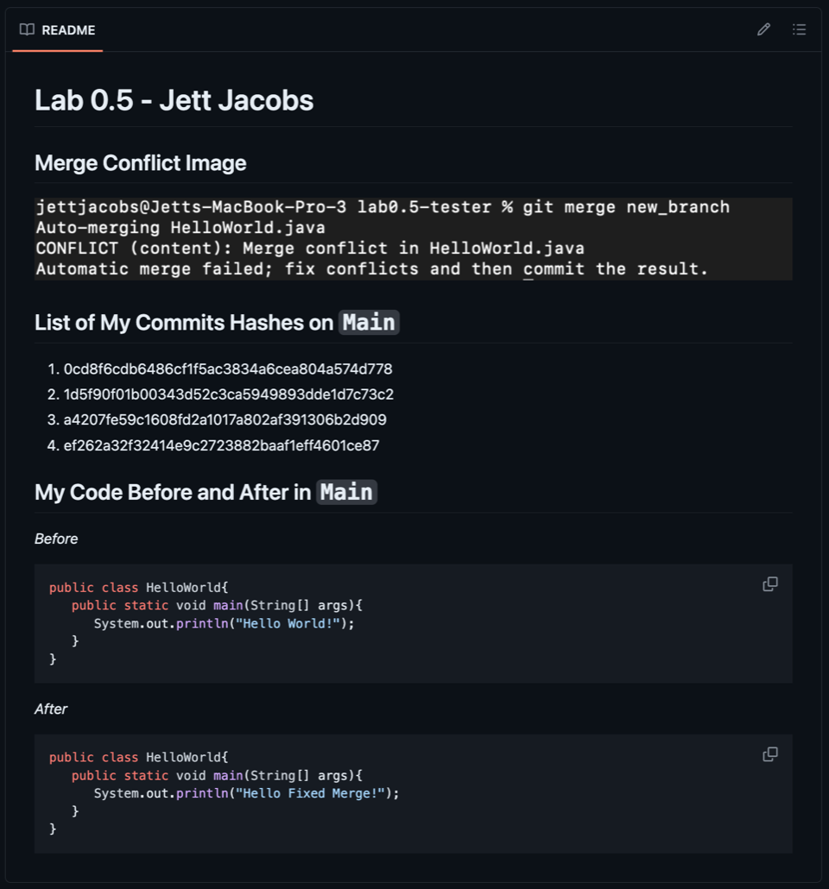

# Lab 0_5: Git Deep Dive and Markdown

The goal of this lab is to get you more comfortable with using more advanced features of `git`, such as branching, resolving conflicts, and forking.

We will also go over some Markdown (a text formatting tool) basics that you can apply to your participation worksheets in this class. Markdown is widely used, in general, and very useful for writing text that will go on webpages.

## Part 1: Github

### Instructions

1. Create a repository on github titled `<github_username>-lab0.5` (replace `<github_username>`). Make sure it is private) 

2. Add the grader as a collaborator

3. Clone the repo onto your computer

4. **On the master branch**, create a file called `HelloWorld.java` (just like we did in lab 0). Write a program to print "Hello World"

5. `add`, `commit`, and `push` to the master branch

6. Create a new branch using terminal commands (you can name the branch whatever you would like)

7. On the new branch, change the print message in `HelloWorld.java` (to whatever you would like, but it must be unique)

8. `add`, `commit`, and `push` to the new branch

9. Return to the master branch

10. Change the print statement (again) in the `HelloWorld.java` file (to something unique), this time **on the master branch**

11. `add`, `commit`, and `push` to the *master* branch

12. Merge the code **from** your *new branch* **to** the *master* 

13. **Take a screenshot of the merge conflict you receive**. You can take a picture of terminal, which indicates that there is a merge conflict; You can take a picture of the `HelloWorld.java` file, which contains markings to indicate that there is a merge conflict; You can take a picture of both.

14. **Resolve the merge conflict**

15. `commit` and `push` to Github on *master*

16. `push` the screenshot of the merge conflict to Github

### Troubleshooting

**Problem**: git is asking me do set something called *upstream*?
> The first time you push to a branch, git may ask you to set the *upstream* to a specific remote server; you can just follow the instructions it prints to the terminal to set the upstream to the correct remote branch.

**Problem**: I forgot to push to master before making a new branch!
> It happens! Just make *another* branch, and push to it. You should end up, eventually, with two branches; that's all that matters for this lab.

## Part 2: Markdown

### Instructions

We will be asking you to generate a markdown file that will look like the screenshot below:

You should write the `README.md` directly in GitHub (online) so that you can take advantage of the preview feature. Once you have your file ready to edit, you should take a look at [this github tutorial](https://docs.github.com/en/get-started/writing-on-github/getting-started-with-writing-and-formatting-on-github/basic-writing-and-formatting-syntax) for instructions on how to get your markdown code to look like the image above.

The TA will explain how to get access to the image you will need to include in your file.

# Grading Rubric

Part 1

|Item | Points |
|the name of the repo for this lab matches the pattern `gitusername-lab0.5` | 5 |
|the grader has been added as a collaborator to the repo| 5 |
|the repo has been made private | 5 |
|there are (at least) two branches| 10 |
|there are (at least) three commits in *master* (should be the case if instructions are followed correctly) | 10 |
|there is (at least) one unique commit in the *new branch* | 10 |
|the first commit of `HelloWorld.java` in *master* differs from `HelloWorld.java` in the *new branch* | 10 |
|there are no remnants of a merge conflict in the final commit to *master* | 10 |
|screenshot proves that you did (at one point) have a merge conflict | 10 |
| TOTAL | 75 |

Part 2

|Item | Points |
|correct different header sizes appear (i.e. # and ##) | 5 |
|image is successfully displayed| 5 |
|the numbered list is successfully displayed| 5 |
|code blocks or code text is succssfully displayed| 5 |
|italics are successfully displayed | 5 |
| TOTAL | 25 |