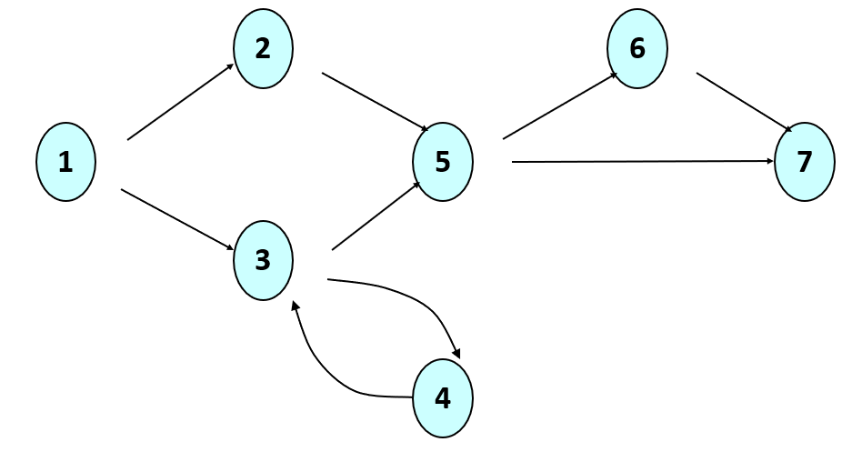

# Worksheet: J1

Please submit your answers to the questions as comments in a `J1.md` markdown file you'll be writing in this lab. To render your file, create a github repo and upload your file there -- it can be viewed in your web browser.

# Grading rubric and submission

When you are done, submit your `J1.md` file as well as your `tests.txt` file to BB.

 You will be graded on the following:

|Item | Points |
|markdown is correctly used as descrived above (5 pts each) | 30 |
|Answers are correct | 20 |
|our tests.txt file that shows all the test cases you wrote in lab (25 pts for any tests, another 25 pts for finding the bug) | 50 |

## Questions


### q

What is fault localization? Provide your answer using at least one **bolded** phrase using markdown.


#### s
Fault localization typically involves tracing back from the line of code producing the incorrect output to where the problem actually was. To do this, a failing test case is needed, as well as the ability to trace through code, whether with print statements or a debugger.

### q

What are three benefits of Test Driven Development (TDD)? Provide your answer using an unordered list in markdown.

#### s
* Your tests are not biased by your code
* Writing tests helps you think about how you might write code
* Writing tests helps you think about the requirements of your system

### q

Given the example of requirements for generating a password:
*    It must have at least one number.
*    It must have at least one uppercase letter.
*    It must have at least one lowercase letter.
*    It must not contain the website gmail anywhere. (For example if we were generating a password for gmail accounts)
*    It can only be made up of letters, numbers, and the underscore.

What are the input domain paritions for this exercise? Provide your answer using an unordered nested lists in markdown.

#### s

First, we have valid and invalid passwords:
* invalid
* valid

But each of these groups can be refined as:
* invalid
*   - missing uppercase letter
*   - missing lowercase letter
*   - missing number
*      - missing all combinations of the three items above
*   - contains `gmail`
*   - contains non-valid characters
* valid

Although the question did not ask for this, more tests could/should be generated by looking at the edge cases between these partitions.

### q

Imagine you are writing test cases to find the minimum of a list.

What are the input domain paritions for this exercise? Provide your answer using an unordered nested lists in markdown.

#### s
 ([1], 1) // lists of size 1
 ([1,2], 1) // lists of size 2, min at start
 ([2,1], 1) // lists if size 2, min at end
 ([1,1], 1) // <--- added another one note above, realizing there could be more than one minimum
 ([1,2,3,4], 1) // lists of size 3+, min at start
 ([4,2,3,1], 1) // lists of size 3+, min at end
 ([3,2,1,4], 1) // lists of size 3+, min in middle
 ([1,2,3], 1) // smallest edge case of lists of size 3+, min at start
 ([2,3,1], 1) // smallest edge case of lists of size 3+, min at end
 ([2,1,4], 1) // smallest lists of size 3+, min in middle
 ([1,3,4,.....], 1) // whatever the longest list is of size 3+, min at start
 ([5,3,4,....7], 1) // whatever the longest list is of size 3+, min at end
 ([2,3,4,..1..], 1) // whatever the longest list is of size 3+, min in middle
 //Copy all tests above, and set 1 to be INTEGER.MIN
 ([INTEGER.MAX], INTEGER.MAX)
 //Copy all tests above, and set 1 to be -1
 //Copy all tests above, and set 1 to be 0

### q

Complete the truth table below to show what inputs we need to achieve *active clause coverage* for the following conditional:

```java
if ( ( (a > b) or G ) and (x < y) )
```

| a > b | G | x < y | predicate outcome | clause responsible |

Google how to make a table in markdown, and use a table to represent your results, like we did in class.

#### s

| a > b | G | x < y | predicate outcome | clause responsible |
|   T   | T |   T   | T                 | x < y              |
|   T   | T |   F   | F                 | x < y              |
|   F   | T |   T   | T                 | G                  |
|   F   | F |   T   | F                 | G                  |
|   T   | F |   T   | T                 | a > b              |
|   F   | F |   T   | F                 | a > b              |


### q

Consider the control flow graph below. What are all the paths (using node numbers) that would achieve full path coverage as a test criteria? Is this a finite set?

When listing all the paths, style your answer so that it appears like code (a code-like font with a gray background).



#### s

The set is infinite because of the loop between 3 and 4:

`
12567
1257
13567
1357
1343567
134357
13434567
1343457
134..567
134..67
`

### q

What benefit does *mutation testing* offer over other testing methods discussed in class? Use a link in markdown to link to the definition of mutation testing we have in our lecture notes from today.

#### s

Mutation testing is automated, in the sense that it solves the *oracle problem*: there is no need to define expected outputs, because we assume the current functionality of the program under test is correct (and therefore the correct output). Our goal is not to test the correctness of this code directly, but to test how complete/effective our test suite is. The assumption is that real bugs will be found in the code if we generate a robust enough test suite.


